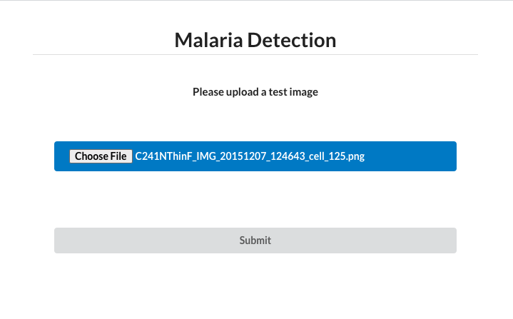

# Malaria Detection

### Requirements

```
pip install -r requirements
```

### Dataset

The data is taken from Kaggle's [Malaria Cell Images Dataset](https://www.kaggle.com/iarunava/cell-images-for-detecting-malaria). It contains 13,757 parasitized and 13,743 uninfected images.

Parasitized / Uninfected


### ML Model

This project trains a `transferred learning` model built on top of `vgg16` to identify infected cell images. The new custom model has an over 95% accuracy rate.

### Deployment

This Flask web app can be deployed on the Google Cloud Platform.


